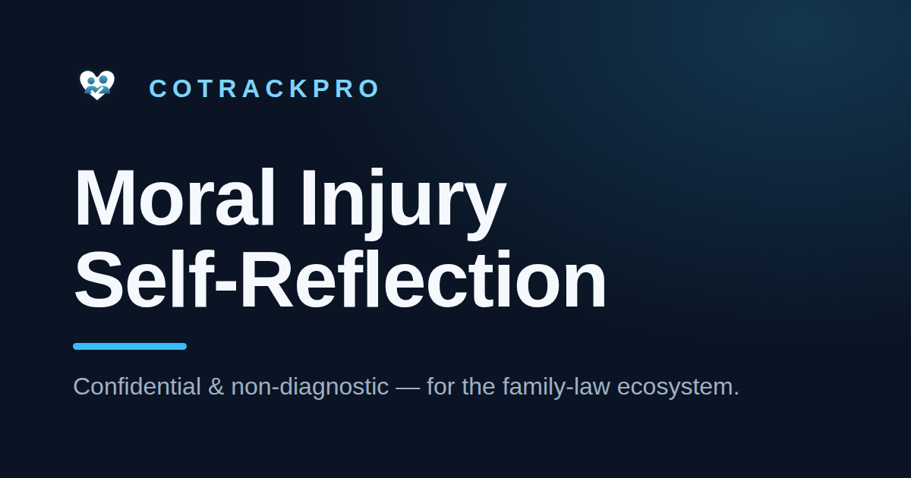

# Moral Injury Self-Reflection — CoTrackPro



**🔗 Live app: [morality.cotrackpro.com](https://morality.cotrackpro.com/)**


A confidential, **non-diagnostic** self-reflection and support toolkit for professionals in the
family-law ecosystem (attorneys, GALs, evaluators, judges, mediators, parenting coordinators,
therapists, caseworkers, court staff, and others).

At its core it separates **exposure** (morally difficult work encountered) from **personal
distress** (how heavily it sits with the person), reflects both back as bands, and routes to
support — and, optionally, repair. There is no single composite "score" and no verdict on the
user. Around that core sits a small toolkit: an accreditable CLE/CE course, in-the-moment
decision aids, habit-building, a moral-climate check for leaders, and more.

> **What it is not:** a clinical diagnosis, a validated psychometric instrument, a legal
> assessment, or a professional/court record. See the in-app disclaimers and `src/content/copy.ts`.

**Private by design.** Everything except the optional pledge wall runs entirely in the browser.
No reflection answer, score, or note leaves the device unless you choose to export or print it.

> **New here?** For a plain-language, non-technical overview of what this project is and what each
> part does, see **[WHAT-IS-THIS.md](WHAT-IS-THIS.md)**.

---

## Contents

- [Quickstart](#quickstart)
- [Modules](#modules)
- [Project structure](#project-structure)
- [Replacing the attorney ethics list](#replacing-the-attorney-ethics-list)
- [Configuration](#configuration)
- [Community pledge wall (optional backend)](#community-pledge-wall-optional-backend)
- [Deployment](#deployment)
- [Tech stack](#tech-stack)
- [Accessibility](#accessibility)
- [License & contributing](#license--contributing)

---

## Quickstart

```bash
npm install
npm run dev        # local dev server (Vite)
npm run test       # vitest — pure logic suite (121 tests)
npm run typecheck  # tsc -b --noEmit
npm run lint       # eslint
npm run format     # prettier --write
npm run build      # production build -> dist/
npm run preview    # serve the built dist/
```

Requires **Node 20+**.

---

## Modules

The app is a multi-part toolkit sharing one top nav (`src/components/Nav.tsx`). An optional
onboarding step captures a role and routes newcomers to a starting module.

- **Course (CLE/CE)** — wraps everything into an accreditable self-study course with
  **role-specific tracks**. Pick a track (attorney, judge, GAL/child's attorney, custody
  evaluator, mediator, parenting coordinator, therapist, social worker/caseworker, court staff,
  paralegal/advocate, or other) and the learning objectives, the knowledge-check post-test, and
  the credit-context guidance all adapt to that role's accrediting world (state bar/MCLE,
  judicial-education authority, ASWB/APA/NBCC, court ADR/mediator boards, etc.). Includes a timed
  agenda, a module checklist, a graded post-test, a course evaluation, a generated **Certificate
  of Completion** (course ID + unique completion ID + provider fields + disclaimer), and a
  per-track **accreditation submission packet** (`.md`). **Not pre-accredited** — the provider
  obtains a provider number and applies per jurisdiction; the "your board is the final authority"
  caveat is baked in throughout.
- **Reflect** — the confidential moral-injury self-reflection (role → 18+ items → two-index result
  + triage). Exposure and distress each map to a band; no composite score.
- **Decide** — guided in-the-moment ethical decision aids (Blanchard & Peale's ethics check, a
  pressure-pause grounded in ethical-fading research, a child-centered lens, and the Markkula five
  lenses).
- **Practice** — build "if-then" habits (implementation intentions; Gollwitzer, 1999) and standing
  commitments, tailored to your reflection profile when present. Export as Markdown or download a
  `.ics` weekly reminder that uses your own calendar (no backend). Optional, on-device persistence.
- **Commit** — a signable **moral-injury-prevention declaration**: affirm a set of first-person
  protective commitments (mapped to the support · ethics · repair · systems tiers), add a personal
  line, and generate a printable declaration/certificate with a unique declaration ID.
- **Encourage** — a private log of **moral wins** — small, values-aligned actions worth
  remembering. On-device only, opt-in, with a printable summary.
- **Share** — a **Share Studio** that renders a shareable poster (PNG) carrying a chosen
  encouragement message and role — no scores or answers. Prefills the role from a completed
  reflection or from onboarding.
- **Standards** — a plain-language reference to the ABA Model Rules of Professional Conduct most
  relevant to family-law work, grouped by category, each linking to the official ABA text.
  Summaries are our own paraphrase (rule text/comments are ABA-copyrighted); a jurisdiction caveat
  is shown throughout. Attorney reflection items are tied to specific rules, and the attorney
  results page surfaces "standards to revisit."
- **The long view** — shows how a single action or inaction ripples across a child's life (in the
  moment → why it lands → over a lifetime), pairing every harm pathway with the protective
  "leverage" move in the professional's control. Grounded in the ACE study (Felitti et al., 1998),
  toxic-stress science (Center on the Developing Child), interparental-conflict research (Cummings
  & Davies; Amato), and the AAP's safe/stable/nurturing-relationships framework, with probabilistic
  (not deterministic) language enforced by a test. Each pathway's leverage can be added to the
  Practice plan as a ready-made if-then habit in one click.
- **Leaders** — a **moral-climate check** for supervisors and firm/court leaders across three
  dimensions (psychological safety, moral load, feeling backed-up), reflected back as banded
  results, plus a printable leader pledge and a moral-debrief template. Feeds the Calculator's
  achievable-reduction input.
- **Calculator** — a transparent, **educational** cost & dividend estimator: a conservative figure
  for the annual cost of unaddressed moral injury, and the protective "dividend" from reducing it.
  Caseload vs. jurisdiction modes; every coefficient is a named, editable assumption (no hidden
  multipliers). Exposure pre-fills from a completed reflection and the achievable reduction from
  the leaders' climate check, both still editable. Pure model in `src/lib/costDividend.ts`.
- **Pledge wall** — an **optional, public** space where professionals stand behind one protective
  commitment. This is the one feature that leaves the device; it is opt-in, gated, and structurally
  walled off from the private reflection (see [Community pledge wall](#community-pledge-wall-optional-backend)).
  Ships **dormant** until a datastore is provisioned.
- **About & evidence** (footer link) — consolidates the design principles (reflective not
  accusatory, leverage not dread, probabilistic not deterministic, private by design, educational
  not advice) and the full grouped evidence base with links.

A daily-prompt widget and a personal streak counter (both on-device only) nudge lightweight
recurring reflection.

## Project structure

```
api/
├── pledges.ts               # GET (paginated public list) + POST (submit) — Vercel Node Function
├── report.ts                # POST to report a pledge (auto-hide after 3 reports)
└── _lib.ts                  # shared server helpers (DynamoDB access, salted-IP rate limiting)

src/
├── main.tsx                 # entry; self-hosted font imports
├── App.tsx                  # top-level view router + onboarding routing
├── types.ts                 # shared types (incl. the View union)
├── index.css                # theme tokens + component styles
├── data/
│   ├── roles.ts             # role list + lenses (12 roles)
│   ├── items.ts             # CORE item bank (all roles)
│   ├── ethicsItems.ts       # ⚠️ attorney ethics PLACEHOLDER — replace with repo list
│   ├── itemSet.ts           # assembles core + role-specific items
│   ├── decisionGuides.ts    # Decide module content (attributed frameworks)
│   ├── habits.ts            # Practice if-then habit library + cue suggestions
│   ├── commitments.ts       # Commit declaration commitments (support/ethics/repair/systems)
│   ├── rules.ts             # ABA Model Rules subset (paraphrased + official links)
│   ├── longView.ts          # Long-view ripple pathways + evidence base
│   ├── course.ts            # CLE course: objectives, timed agenda, role objectives
│   ├── tracks.ts            # role-specific CLE/CE tracks + credit-context guidance
│   └── postTest.ts          # knowledge-check bank + role questions + assembleTest
├── content/
│   ├── config.ts            # scales, crisis resource + threshold (env-overridable)
│   ├── providerConfig.ts    # provider/accreditation fields (env-overridable)
│   └── copy.ts              # all user-facing copy, disclaimers, citations
├── lib/
│   ├── scoring.ts           # bandOf, computeScores (pure)
│   ├── interpret.ts         # quadrant lead + driver line (pure)
│   ├── triage.ts            # flag-driven triage cards (pure)
│   ├── practice.ts          # habit tailoring + markdown/.ics export (pure)
│   ├── climate.ts           # Leaders moral-climate scoring (pure)
│   ├── costDividend.ts      # Calculator cost/dividend model (pure)
│   ├── streak.ts            # daily-prompt streak logic (pure, TZ-safe)
│   ├── storage.ts           # opt-in, on-device-only persistence (plans, wins, streak, climate)
│   ├── courseProgress.ts    # grading, completion eligibility, completion id (pure)
│   ├── certificate.ts       # certificate HTML + accreditation packet builders (pure)
│   ├── schema.ts            # zod result schema + payload builder
│   ├── pledge.ts            # pledge validation/shaping (pure, shared client+server)
│   ├── wallApi.ts           # client-side pledge-wall fetch helpers
│   ├── wallHandlers.ts      # pledge-wall request handlers (tested vs in-memory fake)
│   ├── download.ts          # generic file-download helper
│   ├── print/              # printable-document builders (layout, brand, documents)
│   └── share/              # share-poster canvas renderer
└── components/              # Nav, Home, Onboarding, ReflectFlow, Intro, RoleSelect, Assessment,
                             # Results, CourseHub, PostTest, DecideHub, GuideRunner, PracticeHub,
                             # CommitDeclaration, EncourageHub, ShareStudio, RulesReference,
                             # LongView, LeadersHub, MoralInjuryCalculator, PledgeWall,
                             # DailyPrompt, About, Footer, ErrorBoundary, icons
```

The entire scoring / interpretation / triage / practice / climate / cost / export logic is **pure
and unit-tested (121 tests)** — UI changes can never silently change how results are computed or
how exports are formatted. Test files live next to the modules they cover (`*.test.ts`).

---

## Replacing the attorney ethics list

`src/data/ethicsItems.ts` ships a **clearly-marked placeholder**. To wire in the canonical
list from `track.cotrackpro.com`:

1. For each entry in the repo's ethics-violation list, **reword it from an accusation into a
   first-person reflection** (e.g. "Attorney misled the tribunal" → "I let the court rely on
   something I knew was false"). The source list spots wrongdoing; this tool is for self-reflection.
2. Map each to a subscale: `SELF` (something the user did/allowed) or `WITNESS` (something seen
   and not stopped). `BETRAYAL` and `DISTRESS` stay in the core bank for every role.
3. Set `roles: ["attorney"]` on each entry so it only appears on the attorney path.
4. Keep the attorney path to ~8–12 items so it stays under ~10 minutes.

> Rule numbers in the placeholder are standard ABA Model Rule **titles** used as scaffolding and
> are marked VERIFY. Confirm them against your jurisdiction's adopted rules before shipping.

---

## Configuration

Crisis resource, threshold, and provider fields are configurable without code changes. Set them
in `.env` / your host's env settings for non-US deployments.

| Env var | Default |
|---------|---------|
| `VITE_CRISIS_LABEL` | `988 Suicide & Crisis Lifeline (U.S.)` |
| `VITE_CRISIS_BODY` | US 988 guidance text |
| `VITE_PROVIDER_NAME` | `[Your organization name]` |
| `VITE_PROVIDER_NUMBER` | `[Provider/sponsor number — obtain from each board]` |
| `VITE_COURSE_AUTHOR` | `[Author / faculty name]` |
| `VITE_COURSE_AUTHOR_QUALS` | `[Author qualifications / bio]` |
| `VITE_PROVIDER_CONTACT` | `[Provider contact email]` |

The crisis card appears once the distress index reaches `CRISIS_THRESHOLD` (default `50`) in
`src/content/config.ts`. The provider fields populate the CLE certificate and accreditation
packet — set them before offering the course for credit.

---

## Community pledge wall (optional backend)

The pledge wall is the **only** part of the app that sends data off the device. It is opt-in,
gated, and deliberately **inactive until you provision a datastore** — until then the app builds
and deploys normally and the wall shows a "not enabled yet" state.

### Architecture

- **Endpoints** — Vercel **Node Functions** under `/api` (web-handler signature: `Request` →
  `Response`):
  - `api/pledges.ts` — `GET` (paginated public list) and `POST` (submit a pledge).
  - `api/report.ts` — `POST` to report a pledge; a pledge is auto-hidden after **3** reports.
  - `api/_lib.ts` — shared helpers (DynamoDB access, salted-IP-hash rate limiting). `_`-prefixed
    files are shared modules, not routes.
- **Store** — **Amazon DynamoDB**, a single on-demand table (via `@aws-sdk/lib-dynamodb`).
- The SPA rewrite in `vercel.json` yields to `/api`. DynamoDB calls are server-side (function →
  AWS), so the browser CSP is unaffected.

### Single-table design

One table with a string partition key `pk` and sort key `sk`:

| `pk` | `sk` | Attributes | Purpose |
|------|------|------------|---------|
| `PLEDGE` | `<paddedTs>#<id>` | id, commitmentId, name, roleId, region, ts | a public pledge (newest first) |
| `META` | `COUNT` | n | running total of submissions |
| `REPORT` | `<id>` | reports | per-pledge report counter |
| `HIDDEN` | `<id>` | — | marker; pledge filtered from the wall |
| `RL` | `<ipHash>#<window>` | n, expireAt | rate-limit bucket |

Enable **TTL** on the table with the attribute name **`expireAt`** so rate-limit rows self-clean.

### Activation

1. **Create the table** (on-demand billing) with partition key `pk` (String) and sort key `sk`
   (String); enable TTL on attribute `expireAt`. No secondary indexes are required.
2. **Create an IAM user** (or role) with access limited to that table and generate an access key:
   ```json
   {
     "Effect": "Allow",
     "Action": ["dynamodb:PutItem", "dynamodb:GetItem", "dynamodb:UpdateItem", "dynamodb:Query"],
     "Resource": "arn:aws:dynamodb:<region>:<account>:table/<your-table-name>"
   }
   ```
3. **Set the env vars** below in the Vercel project (Production), then redeploy. The wall goes
   live; **no code change required.**

| Env var | Purpose |
|---------|---------|
| `PLEDGE_DDB_TABLE` | DynamoDB table name |
| `AWS_REGION` | Table's AWS region (e.g. `us-east-1`) |
| `AWS_ACCESS_KEY_ID` | IAM access key id |
| `AWS_SECRET_ACCESS_KEY` | IAM secret access key |
| `PLEDGE_IP_SALT` *(optional)* | Salt for the rate-limiter's IP hash |

The wall stays dormant (`/api/pledges` returns `{"configured":false}`) until the table name,
region, and credentials are all present.

### Privacy & moderation contract

- A submission carries **only**: a commitment chosen from the fixed catalog, an optional first
  name, a role, and a **coarse fixed region**. It **never** accepts reflection answers, scores,
  free-form notes, or any other PII — this is enforced in `src/lib/pledge.ts` (pure, shared by
  client and server, unit-tested).
- Consent is explicit and required server-side. Names are sanitized (letters/spaces/hyphens only,
  length-capped) and profanity-checked; regions must match a fixed list.
- Rate limiting (5 posts/hr/IP) uses only a **salted, truncated SHA-256 of the IP** as an
  ephemeral key — no raw IPs are stored.
- The handler logic is covered by `src/lib/wallHandlers.test.ts` against an in-memory DynamoDB
  fake (validation, rate-limit, pagination/total, report→hide).

---

## Deployment

The app is a static single-page app (build output `dist/`) with optional serverless `/api`
functions for the pledge wall. See **[`DEPLOY.md`](DEPLOY.md)** for hosting options and the Vercel
setup.

## Tech stack

React 18 · TypeScript · Vite · Vitest · Zod · self-hosted Geist Sans · Vercel Analytics / Speed
Insights. Pledge-wall backend: Vercel Node Functions + Amazon DynamoDB (`@aws-sdk/lib-dynamodb`).

## Accessibility

Accessibility is treated as a feature, not an afterthought:

- A **"Skip to content"** link, semantic landmarks, and a visible keyboard focus ring
  (`:focus-visible`) throughout.
- The onboarding dialog uses `role="dialog"` + `aria-modal`, moves focus into itself, and closes
  on <kbd>Esc</kbd>; the assessment scale is a labelled `radiogroup` with arrow-key support.
- Motion is disabled under `prefers-reduced-motion: reduce`.

Verified with an automated **axe-core** pass (WCAG 2.1 A/AA + best-practice) across every view plus
the onboarding and reflection flows — **0 violations** — alongside manual keyboard and
reduced-motion checks. Automated tooling can't catch everything; please open an issue if you hit a
barrier.

## License & contributing

See [`LICENSE`](LICENSE). This repository is `UNLICENSED` (all rights reserved) unless stated
otherwise there — it is a proprietary CoTrackPro project, not open source. External contributions
are not being accepted at this time; please reach out to the CoTrackPro team before reusing or
building on this code.
